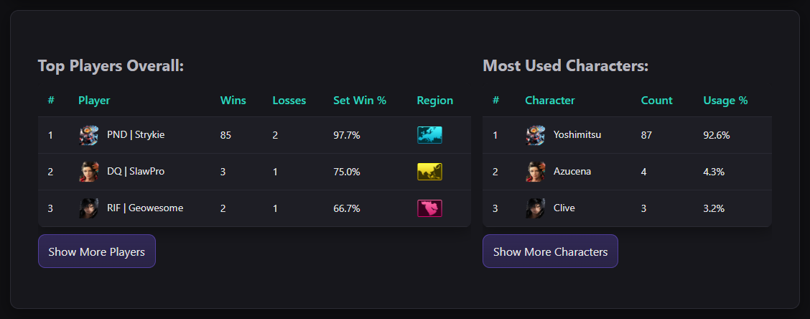

# DQRetro's Tekkenball-Brackets

🌐 Live site: [dqretro.github.io/tekkenball-brackets](https://dqretro.github.io/tekkenball-brackets/)
---

---

## Features & Pages
This project provides a full front-end for **Tekken Ball tournaments, statistics, and media**.  

- **Tournaments** – brackets, matches, standings, players, and event overviews.  
- **Global Statistics** – most used characters, leaderboards, and resettable filters.  
- **Leaderboards** – sortable results across all tracked events.  
- **Player Profiles** – track individual performance and match history.  
- **Video Gallery** – curated YouTube videos dynamically loaded from the Tournament Tracker API.  
- **Updates & Integration** – API-driven content with seamless navigation and UI consistency.  

---

## start.gg API Integration
Tournament data is powered by **start.gg API integration**.  

- Pulls live tournament data directly from **start.gg**.  
- Provides details for **events, brackets, players, standings, and matches**.  
- Keeps the tournament pages synced with official start.gg records.  
- Ensures accuracy and automation for DQRetro’s Tekken Ball tournament coverage.  
- 🔗 Reference: [start.gg API Documentation](https://developer.start.gg/)  

---

## Video Gallery Integration
The **Gallery** page directly integrates with the Tournament Tracker API.  

- `gallery.js` fetches videos directly from the API.  
- Videos are dynamically filtered by **year** and displayed with thumbnails linking to YouTube.  
- Fully synced with DQRetro's content.  

---

## Contributors
- **Sky Williamson** – [GitHub Profile](https://github.com/SlawSimulation)  
- **Harry Mather** – [GitHub Profile](https://github.com/HarryCMather)  
